# Myanmar OCR Data Generator

A text recognition data generator with Myanmar language support, forked from [TextRecognitionDataGenerator (trdg)](https://github.com/Belval/TextRecognitionDataGenerator).

## Overview

This repository extends the original TextRecognitionDataGenerator with specific support for Myanmar language. Key improvements include:

- Added Myanmar language support for synthetic text generation
- Fixed issues with text splitting specific to Myanmar language

## Why This Fork

I've chosen to create a separate repository rather than a PR to the original project as the original repository hasn't been actively maintained recently.

## Features

- All original TRDG features (multiple fonts, background, distortion, etc.)
- Myanmar language support with proper Unicode handling
- Correct text splitting for Myanmar characters
- Support for Myanmar dictionary-based word generation

## Installation

```bash
# Clone the repository
git clone https://github.com/yourusername/myanmar-ocr-data-generator.git
cd myanmar-ocr-data-generator

# Install dependencies
pip install -r requirements.txt
```

## Usage

### Prerequisites

Before using the tool with Myanmar language, you need to generate the Myanmar dictionary file:

1. Run the dictionary generation notebook (notebook/generate-dictionary.ipynb) to generate the `my.txt` dictionary file
2. Place the `my.txt` dictionary file in `trdg/dicts/`

### Command Line Interface

Generate random Myanmar text images:

```bash
cd trdg
python3 run.py -c 10 -l my
```

Generate specific Myanmar text from your text file:

```bash
python3 run.py -l my --dict my_word_list.txt -c 10
```

### Python API

```python
from trdg.generators import GeneratorFromStrings

# Generate images from a Myanmar dictionary
generator = GeneratorFromStrings(
    strings = ["ဂရိဒဏ္ဍာရီ", "သည်", "ရှေးခေတ်ဂရိလူမျိုးများ", "မူလအနေဖြင့်", "ပြောဆိုခဲ့ကြသော", "ဒဏ္ဍာရီ"],
    language='my',
    count=10
)

# Generate your text images
for img, lbl in generator:
    # Do something with the generated image and label
    img.save(f"output/{lbl}.jpg")
```

### Basic (CLI)

`python3 run.py -c 10 -w 5 -f 64 -l my`

You get 1,000 randomly generated images with random text on them like:

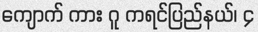
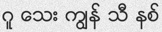


By default, they will be generated to `out/` in the current working directory.

### Text skewing

What if you want random skewing? Add `-k` and `-rk` (`python3 run.py -c 10 -w 5 -f 64 -k 5 -rk -l my`)

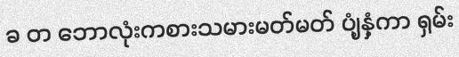
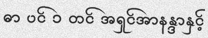
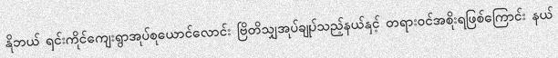
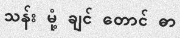
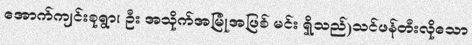

### Text distortion
You can also add distortion to the generated text with `-d` and `-do` (`python3 run.py -c 10 -w 5 -f 64 -k 5 -d 1 -l my`)

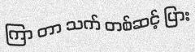

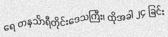

### Text blurring

But scanned document usually aren't that clear are they? Add `-bl` and `-rbl` (`python3 run.py -c 1 -w 5 -f 64 -bl 4 -l my`) to get gaussian blur on the generated image with user-defined radius (here 0, 1, 2, 4):

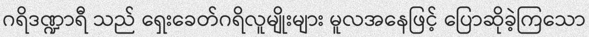

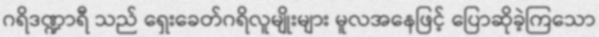
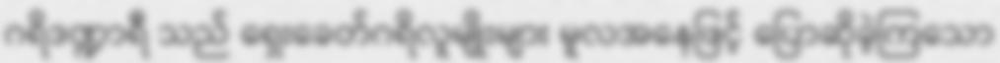

### Background

Maybe you want another background? Add `-b` (`python3 run.py -c 1 -w 5 -f 64 -b 3 -l my`) to define one of the three available backgrounds: gaussian noise (0), plain white (1), quasicrystal (2) or image (3).


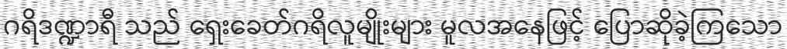


When using image background (3). A image from the images/ folder will be randomly selected and the text will be written on it.

## Acknowledgments

- [TextRecognitionDataGenerator](https://github.com/Belval/TextRecognitionDataGenerator) for the original implementation
